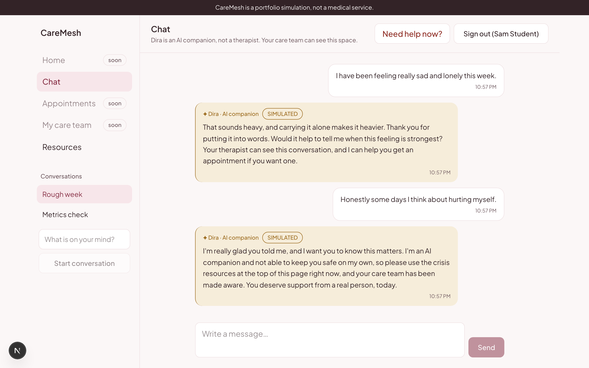
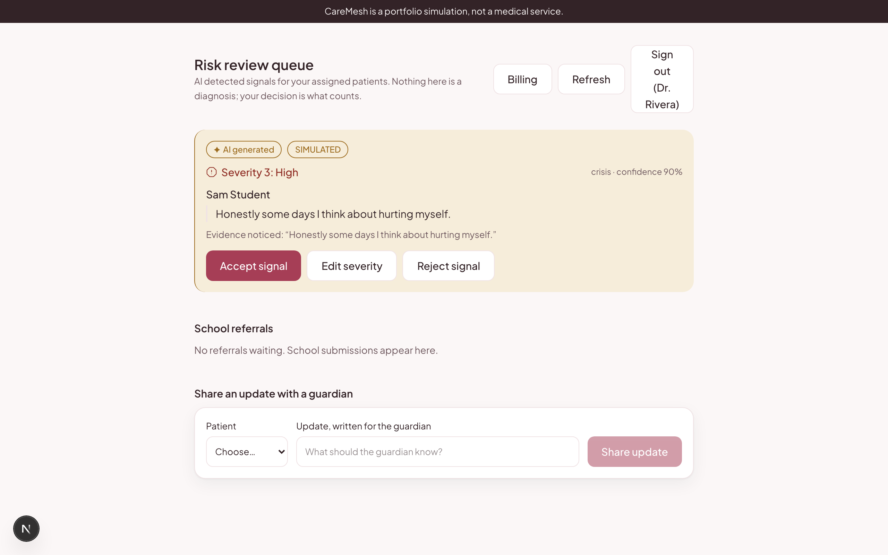
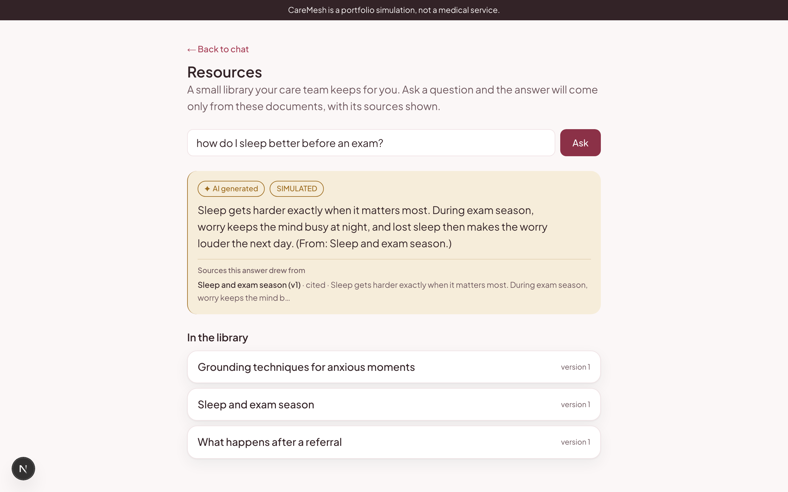
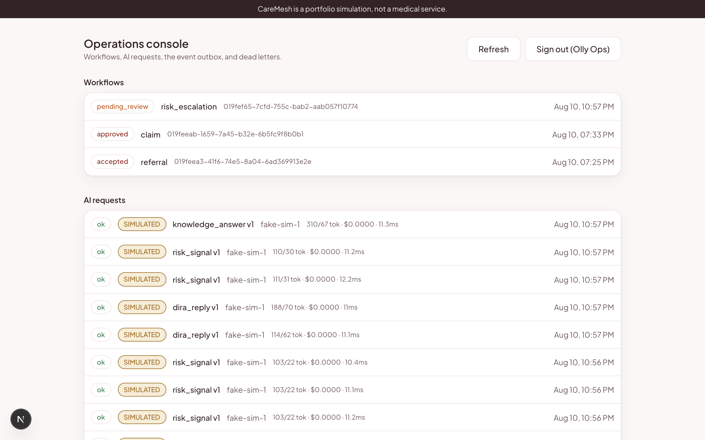
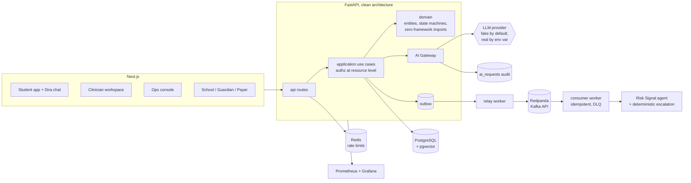

# CareMesh AI

[](https://github.com/Divya1S/CareMesh/actions/workflows/ci.yml)
[](LICENSE)

An AI native youth mental health platform, built end to end as a portfolio
project to demonstrate production grade AI engineering: a safety first AI
companion, real RAG, event driven workflows, human in the loop review, and
an evaluation and observability layer that gates every change.

> **Honesty first:** this is a simulation built to demonstrate engineering.
> It is not a medical product, is not HIPAA compliant, has no clinical
> validity, and must never be used with real patients. Every AI response in
> the default configuration comes from a clearly labeled fake provider, and
> the UI says so on every AI element.

| Student chat with Dira | Clinician risk review |
|---|---|
|  |  |

| Grounded answers with citations | Operations control plane |
|---|---|
|  |  |

## What this demonstrates

| Capability | Where it lives |
|---|---|
| **LLM app engineering** | A central AI Gateway (`backend/app/application/ai/gateway.py`): prompt registry with versions, structured output validation with bounded retry, timeouts, streamed replies over SSE, and full auditing of every call (model, prompt version, tokens, cost, latency, tool calls, outcome) |
| **Agentic tool calling** | A bounded tool loop with allow listed, tenant scoped tools (ADR 0007): Dira searches the resource library (agentic RAG with citations) and files appointment requests as real workflows the care team acknowledges; crisis disclosures bypass tools, gated by evals |
| **RAG that is real** | Versioned documents, paragraph chunking with overlap, embeddings in pgvector with an HNSW index, tenant scoped cosine search plus keyword rerank, grounded answers with visible cited vs retrieved sources, and a stored retrieval trail per question |
| **Evals as a gate** | Three deterministic suites (risk classification with escalation precision and recall, Dira reply safety properties, retrieval hit@k and MRR), run in CI and locally, gated at 100 percent; results stored with model and dataset versions plus latency, token, and cost usage |
| **AI safety architecture** | The model never decides: escalation is deterministic domain code over structured output; crisis paths route to human review; clinician accept, edit, and reject are explicit audited acts; prompt injection cases are regression tested |
| **Event driven systems** | Transactional outbox, a relay publishing to Redpanda (Kafka API), idempotent consumers (one transaction covers the idempotency mark and all effects), bounded retries, dead letter topics, safe replay from the ops console |
| **Workflow engineering** | A small explicit state machine engine: risk escalation, school referrals, and insurance claims, each with validated transitions and append only, actor attributed history |
| **LLMOps and cost engineering** | Per request cost and token accounting, Prometheus metrics with a provisioned Grafana dashboard, rate limits on AI bearing endpoints, and a fake first provider strategy that keeps all development at zero dollars |
| **Security engineering** | Argon2id auth with rotating single use refresh tokens, RBAC plus resource level authorization on every use case, tenant isolation tested cross org, Redis rate limiting, an append only audit trail, a written threat model |
| **Full stack product** | FastAPI clean architecture backend, Next.js App Router frontend with a token based design system, six role surfaces, OpenAPI generated types, Playwright E2E |

## Architecture



The canonical flow: a student messages Dira, the reply streams back from
the gateway, the message event travels through the outbox and Redpanda to
the risk consumer, the Risk Signal agent produces a structured signal,
deterministic thresholds decide whether a review workflow opens, the
therapist accepts, edits, or rejects it in their queue, guardians get only
what the care team explicitly shares, and operations can inspect every
workflow, AI call, and event, including replaying events safely.

## Numbers that are real

| Metric | Value |
|---|---|
| Backend tests (unit + integration against real Postgres, Redis, Redpanda) | 105 |
| Frontend tests | 13 |
| Gated eval cases (risk, Dira safety and tool use, retrieval) | 23/23 |
| Escalation precision / recall on the eval set | 1.0 / 1.0 |
| Retrieval hit@1 / MRR: lexical embeddings (default) | 0.5 / 0.583 |
| Retrieval hit@1 / MRR: semantic embeddings (fastembed, local) | 1.0 / 1.0 |
| Total AI spend across all development | $0.00 |
| External paid services required | none |

The retrieval rows are the same suite run under both embedding providers;
the paraphrase cases lexical misses and semantic finds, plus the per
provider no answer thresholds that keep off domain refusal working in
both spaces, are written up in [docs/EVALUATION.md](docs/EVALUATION.md).

## Quickstart

Prereqs: Docker, uv, Node 20+.

```bash
docker compose up -d                    # Postgres (pgvector), Redis, Redpanda
cd backend && uv sync && uv run alembic upgrade head
uv run python -m scripts.seed           # demo org, users, resource documents
uv run uvicorn app.main:app --port 8000
# separate terminals:
uv run python -m app.workers.relay
uv run python -m app.workers.conversation_consumer
cd ../frontend && npm install && npm run dev
```

Then open http://localhost:3000 and sign in (password `caremesh-demo`):

| Role | Email | Lands on |
|---|---|---|
| Student | student@demo.caremesh.org | Chat with Dira |
| Therapist | therapist@demo.caremesh.org | Risk review queue, referrals, billing |
| Ops admin | ops@demo.caremesh.org | Operations console |
| School staff | school@demo.caremesh.org | Roster and referrals |
| Guardian | guardian@demo.caremesh.org | Guardian portal |
| Payer staff | payer@demo.caremesh.org | Claims review |

One command gates everything (lint, migrations, tests, evals):

```bash
./scripts/verify.sh
# browser journey across four roles:
./scripts/e2e.sh
# observability stack (off by default): Prometheus :9090, Grafana :3001
docker compose --profile observability up -d
```

## Deliberate choices (and the interview stories behind them)

- **No agent framework.** The workflow engine, tool orchestration, and
  gateway are written from scratch on Postgres so that every retry,
  timeout, and state transition is visible and tested. Frameworks like
  LangGraph solve real problems; here the point is demonstrating the
  mechanics they abstract.
- **Fake first AI provider, with a real adapter proving the seam.** All
  development and CI run against a deterministic, clearly labeled fake
  provider behind the same interface as real adapters. Tests and evals
  are reproducible and free, and the simulated flag flows from the
  provider through the audit log to a badge on every AI element in the
  UI. A real Gemini adapter (plain httpx, free tier, `LLM_PROVIDER=gemini`
  plus a key) plugs into the same gateway with tool calling, structured
  output, and streaming; `uv run python -m scripts.live_check` is an opt
  in script that proves a real reply, a validated risk classification,
  and a stream all land in the audit trail with `simulated=false`. It is
  never part of verify.sh or CI. Anthropic and OpenAI adapters would be
  the same shape but have no free tier, so an Ollama adapter for local
  models is the documented next provider.
- **Two embedding providers, measured against each other.** The default
  is hashing based lexical embeddings (real retrieval, zero cost, no
  downloads); `EMBEDDING_PROVIDER=fastembed` switches to a local semantic
  model (bge-small, ONNX). Chunks record their embedding space, search
  never mixes spaces, and each provider carries a measured no answer
  threshold, because absolute similarity cutoffs do not transfer between
  spaces. See ADR 0006 and the comparison in docs/EVALUATION.md.
- **Redpanda over Kafka.** Same wire protocol and client code, a fraction
  of the laptop footprint. See ADR 0001.
- **Events carry ids, never clinical text.** Consumers fetch content from
  the source of truth, keeping message bodies out of broker logs and dead
  letters.

## What I would do with a budget

Real model evaluation runs against the existing suites (the harness is
built; only the assertions need judgment for nondeterministic output),
semantic embedding comparison at corpus scale, fine tuning a small model
with QLoRA on synthetic conversation data for the risk classifier and
comparing it against the prompted baseline in the same eval harness, and
paid observability (tracing spans across the event pipeline).

## Documentation

| Doc | Contents |
|---|---|
| [docs/ARCHITECTURE.md](docs/ARCHITECTURE.md) | System shape and layer rules |
| [docs/AI_ARCHITECTURE.md](docs/AI_ARCHITECTURE.md) | Gateway, providers, prompts, provenance |
| [docs/EVENTS.md](docs/EVENTS.md) | Event mechanics and the full catalog |
| [docs/WORKFLOWS.md](docs/WORKFLOWS.md) | State machines and their guarantees |
| [docs/EVALUATION.md](docs/EVALUATION.md) | Eval suites, metrics, feedback loop |
| [docs/OBSERVABILITY.md](docs/OBSERVABILITY.md) | Metrics catalog and dashboards |
| [docs/SECURITY.md](docs/SECURITY.md) | Controls, limitations, real world gap |
| [docs/THREAT_MODEL.md](docs/THREAT_MODEL.md) | Threats, mitigations, failure modes |
| [docs/DATABASE.md](docs/DATABASE.md) | Schema and access patterns |
| [docs/API.md](docs/API.md) | API conventions and surfaces |
| [docs/LOCAL_DEVELOPMENT.md](docs/LOCAL_DEVELOPMENT.md) | Everything about running it |
| [docs/DESIGN.md](docs/DESIGN.md) | The design system and its rules |
| [docs/adr/](docs/adr/) | Architecture decision records |

## License

MIT. Fictional data only; no real patients, clinicians, or organizations.
